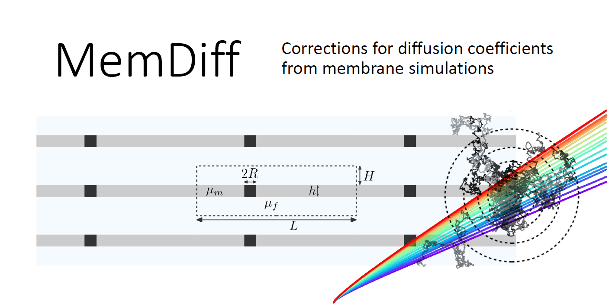
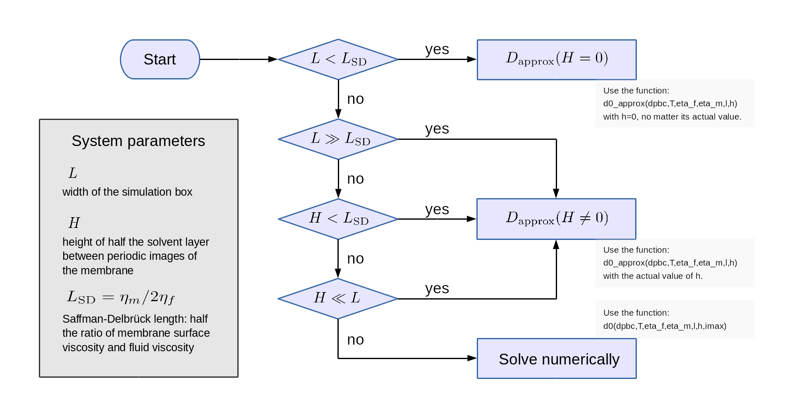

Lateral diffusion cefficients in membrane simulations with periodic boundary conditions are subject to substantial hydrodynamic finite-size effects.
You can use the implementation of the correction formulas here to obtain the unperturbed value from the values calculated in the simulation.

## Requirements
Python 3 and packages numpy, scipy, sys, os, pickle. 

## Usage
The package contains three files:
 - _memdiff.py_: implementation of the Oseen corrections for transmembrane and monotopic components (1,2) as well as the flat-box approximation (1).
 - _memdiff_immersed_boundary.py_: implementation of correction formulas from the immersed-boundary method (3).
 - _analysis_diffusion.py_: a framework to analyse data sets of diffusion coefficients obtained from different box geometries (2).
 
Import each file as a module into your python code:

    # Functions for membrane diffusion
    import memdiff as memd
    import memdiff_immersed_boundary as mdib
    # analysis routines
    from analysis_diffusion import *

To calculate, for example, the corrected diffusion coefficient according to the numerical Oseen correction (1,2), call

    memd.d0(dpbc,T,eta_f,eta_m,l,h,imax)
    
with the following parameters:

    dpbc:  uncorrected diffusion coefficient in m^2/s, 
    T:     temperature in K
    eta_f: solvent viscosity in Pa*s
    eta_m: membrane surface viscosity in Pa*s*m
    l:     width of the simulation box
    h:     height of the simulation box
    imax:  maximal index of k-space vectors to take into account. 

The higher imax, the more precise and the slower the calculation. 20 is usually a good compromise.
    
There are analogous functions for the approximation formula and for the monotopic correction (see chart below).

An example Jupyter notebook is provided that uses data from a simulation of a carbon nanotube porin in a POPC/DOPC membrane to show the usage of the more advanced analysis functions. It shows how to fit the diffusion coefficient and the membrane viscosity from a series of simulations at different values of the box width.

## Which correction formula should I use?

A PDF version of the flow chart is available .

Details and tests are described in our papers (1,2).

## Literature
 - (1) M. Vögele and G. Hummer: Divergent Diffusion Coefficients in Simulations of Fluids and Lipid Membranes; J. Phys. Chem. B, 2016, 120 (33), pp 8722–8732; DOI: 10.1021/acs.jpcb.6b05102
 - (2) M. Vögele, J. Köfinger, and G. Hummer: Hydrodynamics of Diffusion in Lipid Membrane Simulations, Phys. Rev. Lett. 2018, 120, 268104. DOI: 10.1103/PhysRevLett.120.268104 (preprint available at arXiv:1803.04714)
 - (3) B. A. Camley, M. G. Lerner, R. W. Pastor., F. L. Brown: Strong influence of periodic boundary conditions on lateral diffusion in lipid bilayer membranes. J Chem Phys. 2015 Dec 28;143(24):243113. doi: 10.1063/1.4932980.
